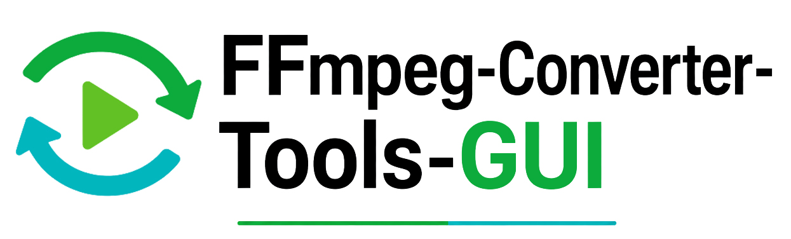
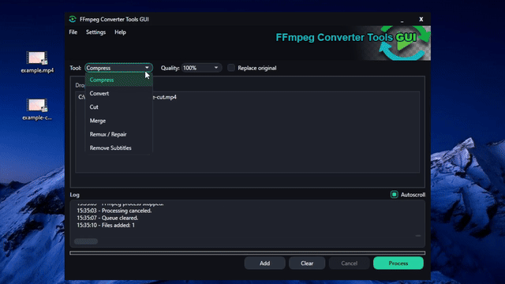
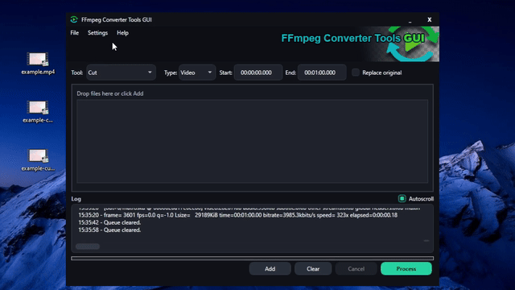

# FFmpeg Converter Tools GUI

A native Windows desktop app that turns everyday FFmpeg workflows into a simple drag-and-drop interface.

FFmpeg Converter Tools GUI was built for users who need quick media conversion, compression, trimming, remuxing, and cleanup without memorizing command-line syntax. It wraps practical FFmpeg commands in a focused WPF interface with batch processing, realtime logs, cancellation, persistent settings, and automatic FFmpeg setup.



## Highlights

- Native Windows WPF interface.
- Drag-and-drop file queue.
- Batch processing for multiple files.
- Realtime FFmpeg log output with optional autoscroll.
- Background processing so the UI stays responsive.
- Cancel button that stops the active FFmpeg process.
- Automatic FFmpeg discovery and download when missing.
- Dark and light themes with persistent `settings.ini`.

- Optional `Replace original` workflow for supported operations.

## Tools

### Compress

Compress MKV and MP4 videos with selectable quality from `100%` to `10%`.

### Convert

Convert between common media formats:

- Video: `MP4`, `MKV`, `AVI`, `MOV`, `WEBM`
- Audio: `MP3`, `WAV`, `OGG`, `FLAC`, `M4A`, `OPUS`
- Image: `PNG`, `JPG`, `WEBP`, `BMP`, `TIFF`, `GIF`

GIF output can generate animated GIFs from video using FFmpeg palette generation for better color quality.

### Cut

Cut video or audio using start/end timestamps with millisecond precision.

Example format:

```text
00:01:12.500
```

Leading zeros are optional, so values like `0:1:12.500` are accepted too.

### Merge

Merge multiple video files into one output file.

Supported containers:

- `MP4`
- `MKV`
- `AVI`
- `MOV`
- `WEBM`

All files in the merge queue must use the same container format.

### Remux / Repair

Rebuild a media container without re-encoding streams. This is useful for fixing some container issues or quickly repackaging compatible streams.

### Remove Subtitles

Remove embedded subtitle streams from MKV or MP4 files while copying the remaining streams.

## FFmpeg Handling

The app looks for FFmpeg in this order:

1. `ffmpeg` available in `PATH`
2. `ffmpeg.exe` beside the application executable
3. Automatic download of a Windows FFmpeg build from BtbN if FFmpeg is missing

Only `ffmpeg.exe` is extracted next to the app executable.

## Build

Requirements:

- Windows
- Visual Studio 2019/2022 or MSBuild
- .NET Framework 4.8 Developer Pack / targeting pack

Build from PowerShell:

```powershell
MSBuild.exe FFmpegConverterGUI.csproj /p:Configuration=Release /p:Platform=x64
```

The executable is created at:

```text
bin\Release\FFmpegConverterGUI.exe
```


## Notes And Limitations

- MP4 subtitle preservation is intended for text-based subtitle streams that can be converted to `mov_text`.
- Bitmap subtitle formats such as PGS or VobSub may need a different workflow.
- Merge supports common video containers, but all files in the same merge job must use the same container format.
- GIF conversion uses `12 FPS` and a `640px` output width by default to keep files manageable.
- The app invokes FFmpeg as a separate process instead of linking FFmpeg libraries.

## License

This project is licensed under the MIT License. See [LICENSE](LICENSE) for details.

This application uses FFmpeg as an external command-line tool. FFmpeg is a separate third-party project with its own licensing terms. See the [FFmpeg legal page](https://www.ffmpeg.org/legal.html) for details.

## Credits

Created by **R4wd0G**.


Powered by [FFmpeg](https://ffmpeg.org/), a third-party multimedia framework. 

FFmpeg builds are downloaded from [BtbN/FFmpeg-Builds](https://github.com/BtbN/FFmpeg-Builds) when FFmpeg is not already available.

Made with help from GitHub Copilot.
